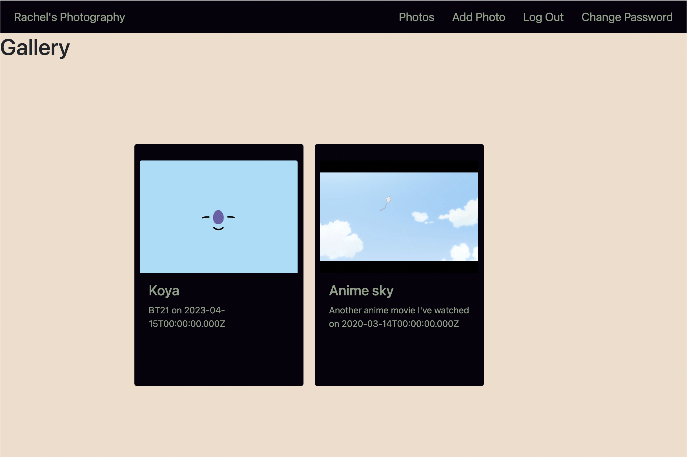

# Rachel Bui's Photography Portfolio
My friend asked if I would be able to create an website where she could showcase the concert photos she's taken over the years. I'm still working on fixing the date/time display, mobile view, and possibly changing the name of this app. But this app only exists because my friend asked me to build it, so we'll see 😄 

## Deployed Site:
(https://rachel-photo-portfolio.netlify.app/)

### Back End:
(https://github.com/ilsyim/rachel-back)

## Technologies used:
- HTML
- CSS
- JavaScript
- React
- Bootstrap
  
Screenshot:

## Credits:
- [Favicon made with Favicon.io](https://favicon.io/favicon-generator/)
- stack overflow for image uploading issues